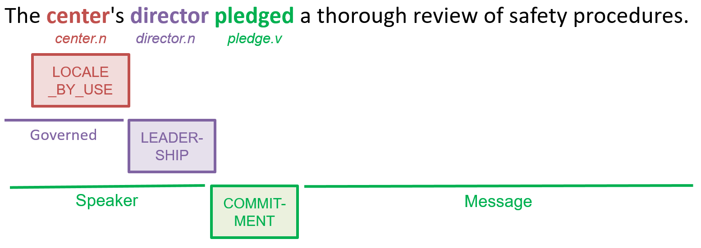
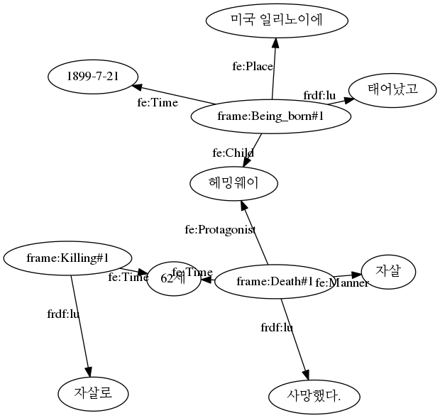

# frameBERT: BERT for frame-semantic parsing
**\*\*\*\*\* \[Update\] April, 2020. THIS IS A WORKING PROJECT  \*\*\*\*\***

The frameBERT is available for both of [English FrameNet 1.7](https://framenet.icsi.berkeley.edu/fndrupal/) and [Korean FrameNet 1.1](https://github.com/machinereading/koreanframenet).

## About
The frameBERT is a frame-semantic parser to understand the meaning of texts in terms of [FrameNet](https://framenet.icsi.berkeley.edu/fndrupal/). 

**frame** (frame semantics) is a schematic representation of a situation or an event. 
For an example sentence, "The center's director pledged a thorough review of safety precedures", frameBERT identifies several frames such as `Being_born` and `Death` for lexical units (e.g., `center.n`, `director.n` and `pledge.v`).



## prerequisite
* `python 3`
* `pytorch` ([Link](https://pytorch.org/)
* `transformers` ([Link](https://github.com/huggingface/transformers/tree/9a0a8c1c6f4f2f0c80ff07d36713a3ada785eec5#installation))
* `Korean FrameNet` ([Link](https://github.com/machinereading/koreanframenet))
* `keras` ([Link](https://keras.io/#installation))
* `nltk` (for target identification)
* `flask_restful` (for REST API service)
For `nltk`, please download following packages: `nltk.download('averaged_perceptron_tagger')` and `nltk.download('wordnet')`

## How to use
**Install**

Install `frameBERT`, and `Korean FrameNet`.
**Note: Korean FrameNet would be not mandatory package in next update**
```
git clone https://github.com/machinereading/frameBERT.git
cd frameBERT
git clone https://github.com/machinereading/koreanframenet.git
```

### How to use a frame-semantic parser for a language (English or Korean)

**Download the pretrained model**

Download two pretrained model files to `{your_model_dir}` (e.g. `/home/model/`). 
* **English Model (recommended for English):** ([download](https://drive.google.com/open?id=1bDUoIniUNUm2I0ztXWo6hitOpLmU9lv4))
* **Multilingual Model (English & Korean):** ([download](https://drive.google.com/open?id=1CN4PnLJ0fuGzWsqXSpJEhC-_YMmuQfgL))

**Import model (in your python code)**
(make sure that your code is in a parent folder of frameBERT)
```
from frameBERT import frame_parser

model_path = {your_model_dir} # absolute_path (e.g. /home/model/)
parser = frame_parser.FrameParser(model_path=model_path, language='en')
```
***optional***: If you want to DO NOT USE LU DICTIONARY, set argument `masking=False`)


**Parse the input text**
```
text = 'text = 'Hemingway was born on July 21, 1899 in Illinois, and died of suicide at the age of 62.'
parsed = parser.parser(text, sent_id='1', result_format='graph')
```
```
[('frame:Giving_birth#1', 'frdf:lu', 'born'),
 ('frame:Giving_birth#1', 'frdf:Giving_birth-Child', 'Hemingway'),
 ('frame:Giving_birth#1', 'frdf:Giving_birth-Time', 'on July 21, 1899'),
 ('frame:Giving_birth#1', 'frdf:Giving_birth-Place', 'in Illinois,'),
 ('frame:Death#1', 'frdf:lu', 'died'),
 ('frame:Death#1', 'frdf:Death-Protagonist', 'Hemingway'),
 ('frame:Death#1', 'frdf:Death-Explanation', 'of suicide'),
 ('frame:Killing#1', 'frdf:lu', 'suicide'),
 ('frame:Killing#1', 'frdf:Killing-Victim', 'Hemingway'),
 ('frame:Age#1', 'frdf:lu', 'age'),
 ('frame:Age#1', 'frdf:Age-Age', 'of 62.')]
```


**Also, you can run the Korean FrameBERT for the korean text**
```
parser = frame_parser.FrameParser(model_path=model_path, language='ko')
text = '헤밍웨이는 1899년 7월 21일 미국 일리노이에서 태어났고 62세에 자살로 사망했다.'
parsed = parser.parser(text, sent_id='1', result_format='all')
```



***optional***: `sent_id` and `result_format` are not mandatory arguments. 
You can get the result in following argument: `conll`', `graph`, `textae`, and `all`.
The result consits of following three parts: 

(1) triple format (`result_format='graph'`)
(2) conll format (`result_format='conll'`)
(3) [pubannotation format](https://textae.pubannotation.org/) (`result_format='textae'`)

Or, you can get all result in json by `result_format='all'`


**result**

***triple format (as a Graph)***
The result is a list of triples.
```
[
    ('frame:Giving_birth#1', 'frdf:lu', 'born'), 
    ('frame:Giving_birth#1', 'frdf:Giving_birth-Child', 'Hemingway'), 
    ('frame:Giving_birth#1', 'frdf:Giving_birth-Time', 'on July 21, 1899'), 
    ('frame:Giving_birth#1', 'frdf:Giving_birth-Place', 'in Illinois,'), 
    ...
]
```

***conll format***
The result is a list, which consists of multiple Frame-Semantic structures. Each SRL structure is in a list, which consists of four lists: (1) tokens, (2) lexical units, (3) its frames, and (4) its arguments. For example, for the given input text, the output is in the following format:

```
[
    [
        ['Hemingway', 'was', 'born', 'on', 'July', '21,', '1899', 'in', 'Illinois,', 'and', 'died', 'of', 'suicide', 'at', 'the', 'age', 'of', '62.'], 
        ['_', '_', 'bear.v', '_', '_', '_', '_', '_', '_', '_', '_', '_', '_', '_', '_', '_', '_', '_'], 
        ['_', '_', 'Giving_birth', '_', '_', '_', '_', '_', '_', '_', '_', '_', '_', '_', '_', '_', '_', '_'], 
        ['B-Child', 'O', 'O', 'B-Time', 'I-Time', 'I-Time', 'I-Time', 'B-Place', 'I-Place', 'O', 'O', 'O', 'O', 'O', 'O', 'O', 'O', 'O']
    ], 
    [
    ...
]
```


[
    [
        ['헤밍웨이는', '1899년', '7월', '21일', '미국', '일리노이에서', '태어났고,', '62세에', '자살로', '사망했다.'], 
        ['_', '_', '_', '_', '미국.n', '_', '_', '_', '_', '_'], 
        ['_', '_', '_', '_', 'Origin', '_', '_', '_', '_', '_'], 
        ['O', 'O', 'O', 'O', 'O', 'B-Entity', 'O', 'O', 'O', 'O']
    ], 
    [
        ['헤밍웨이는', '1899년', '7월', '21일', '미국', '일리노이에서', '태어났고,', '62세에', '자살로', '사망했다.'],
        ['_', '_', '_', '_', '_', '_', '태어나다.v', '_', '_', '_'], 
        ['_', '_', '_', '_', '_', '_', 'Being_born', '_', '_', '_'], 
        ['B-Child', 'B-Time', 'I-Time', 'I-Time', 'B-Place', 'I-Place', 'O', 'O', 'O', 'O']
    ], 
    [
        ['헤밍웨이는', '1899년', '7월', '21일', '미국', '일리노이에서', '태어났고,', '62세에', '자살로', '사망했다.'], 
        ['_', '_', '_', '_', '_', '_', '_', '_', '자살.n', '_'], 
        ['_', '_', '_', '_', '_', '_', '_', '_', 'Killing', '_'], 
        ['B-Victim', 'O', 'O', 'O', 'O', 'O', 'O', 'O', 'O', 'O']
    ],
    [
        ['헤밍웨이는', '1899년', '7월', '21일', '미국', '일리노이에서', '태어났고,', '62세에', '자살로', '사망했다.'], 
        ['_', '_', '_', '_', '_', '_', '_', '_', '_', '사망.n'], 
        ['_', '_', '_', '_', '_', '_', '_', '_', '_', 'Death'], 
        ['B-Protagonist', 'O', 'O', 'O', 'O', 'O', 'O', 'B-Time', 'B-Manner', 'O']
    ]
]
```


## Licenses
* `CC BY-NC-SA` [Attribution-NonCommercial-ShareAlike](https://creativecommons.org/licenses/by-nc-sa/2.0/)
* If you want to commercialize this resource, [please contact to us](http://mrlab.kaist.ac.kr/contact)

## Publisher
[Machine Reading Lab](http://mrlab.kaist.ac.kr/) @ KAIST

## Contact
Younggyun Hahm. `hahmyg@kaist.ac.kr`, `hahmyg@gmail.com`

## Acknowledgement
This work was supported by Institute for Information & communications Technology Promotion(IITP) grant funded by the Korea government(MSIT) (2013-0-00109, WiseKB: Big data based self-evolving knowledge base and reasoning platform)
