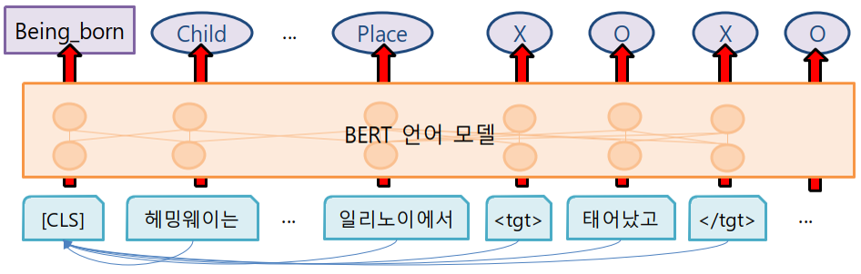

# KAISER: KAIst Semantic parsER
**\*\*\*\*\* \[Update\] November, 2019  \*\*\*\*\***

Kaiser is available for both of English FrameNet and [Korean FrameNet](https://github.com/machinereading/koreanframenet) 

## About
Kaiser is a semantic parser to understand the meaning of texts in terms of [FrameNet](https://framenet.icsi.berkeley.edu/fndrupal/). 

**frame** (frame semantics) is a schematic representation of a situation or an event. 
For an example sentence, '헤밍웨이는 1899년 7월 21일 일리노이에서 태어났고, 62세에 자살로 사망했다.', KAIST-frame-parser identifies several frames such as `Being_born` and `Death` for Korean lexical units (e.g. 태어나다.v and 사망하다.v)


Our model is based on the BERT with fine-tuning. The model predict Frames and their arguments jointly.



## prerequisite
* `python 3`
* `pytorch-pretrained-BERT` ([Link](https://github.com/huggingface/pytorch-pretrained-BERT))
* `Korean FrameNet` ([Link](https://github.com/machinereading/koreanframenet))

## How to use
**Install**

Install `transformers`, `kaiser`, and Korean FrameNet
```
pip install transformers
git clone https://github.com/machinereading/kaiser.git
cd ./kaiser
git clone https://github.com/machinereading/koreanframenet.git
```

### How to use a single-language frame-semantic parser

**Download the pretrained model**

Download two pretrained model files to `{your_model_dir}` (e.g. `/home/model/bert_ko_srl_model.pt`). 
* **Korean Model:** ([download](https://drive.google.com/open?id=1HTytgRg6xpXTJgZOvif1tcuLNr5yojRt))
* **English Model:** ([download](https://drive.google.com/open?id=1HTytgRg6xpXTJgZOvif1tcuLNr5yojRt))
* **Multilingual Model (En+Ko):** ([download](https://drive.google.com/open?id=1HTytgRg6xpXTJgZOvif1tcuLNr5yojRt))

**Import model (in your python code)**
(make sure that your code is in a parent folder of kaiser)
```
from kaiser import kaiser

model_path = {your_model_dir} # absolute_path (e.g. /home/model/bert_ko_frame_model.pt)
parser = parser.ShallowSemanticParser(model_path=model_path, masking=True)
```
***optional***: If you want to DO NOT USE LU DICTIONARY, set argument `masking=False`)


**Parse the input text**
```
text = '헤밍웨이는 1899년 7월 21일 미국 일리노이에서 태어났고 62세에 자살로 사망했다.'
parsed = parser.parser(text, sent_id='1', result_format='all')
```
***optional***: `sent_id` and `result_format` is not mandatory argument. 
You can get the result in following argument: `conll`', `graph`, `textae`, and `all`.
The result consits of following three parts: 

(1) triple format (`result_format='graph'`)
(2) conll format (`result_format='conll'`)
(3) [pubannotation format](https://textae.pubannotation.org/) (`result_format='textae'`)

Or, you can get all result in json by `result_format='all'`


**result**

***conll format***
The result is a list, which consists of multiple Frame-Semantic structures. Each SRL structure is in a list, which consists of four lists: (1) tokens, (2) lexical units, (3) its frames, and (4) its arguments. For example, for the given input text, the output is in the following format:

```
[
    [
        ['헤밍웨이는', '1899년', '7월', '21일', '미국', '일리노이에서', '태어났고,', '62세에', '자살로', '사망했다.'], 
        ['_', '_', '_', '_', '미국.n', '_', '_', '_', '_', '_'], 
        ['_', '_', '_', '_', 'Origin', '_', '_', '_', '_', '_'], 
        ['O', 'O', 'O', 'O', 'O', 'B-Entity', 'O', 'O', 'O', 'O']
    ], 
    [
        ['헤밍웨이는', '1899년', '7월', '21일', '미국', '일리노이에서', '태어났고,', '62세에', '자살로', '사망했다.'],
        ['_', '_', '_', '_', '_', '_', '태어나다.v', '_', '_', '_'], 
        ['_', '_', '_', '_', '_', '_', 'Being_born', '_', '_', '_'], 
        ['B-Child', 'B-Time', 'I-Time', 'I-Time', 'B-Place', 'I-Place', 'O', 'O', 'O', 'O']
    ], 
    [
        ['헤밍웨이는', '1899년', '7월', '21일', '미국', '일리노이에서', '태어났고,', '62세에', '자살로', '사망했다.'], 
        ['_', '_', '_', '_', '_', '_', '_', '_', '자살.n', '_'], 
        ['_', '_', '_', '_', '_', '_', '_', '_', 'Killing', '_'], 
        ['B-Victim', 'O', 'O', 'O', 'O', 'O', 'O', 'O', 'O', 'O']
    ],
    [
        ['헤밍웨이는', '1899년', '7월', '21일', '미국', '일리노이에서', '태어났고,', '62세에', '자살로', '사망했다.'], 
        ['_', '_', '_', '_', '_', '_', '_', '_', '_', '사망.n'], 
        ['_', '_', '_', '_', '_', '_', '_', '_', '_', 'Death'], 
        ['B-Protagonist', 'O', 'O', 'O', 'O', 'O', 'O', 'B-Time', 'B-Manner', 'O']
    ]
]
```

Another example sentence is '그는 그녀와 사랑에 빠졌다.'.
```
[
    [
        ['그는', '그녀와', '사랑에', '빠졌다.'], 
        ['_', '_', '사랑.n', '_'], 
        ['_', '_', 'Personal_relationship', '_'], 
        ['B-Partner_1', 'B-Partner_2', 'O', 'O']
    ],
    [
        ['그는', '그녀와', '사랑에', '빠졌다.'], 
        ['_', '_', '_', '빠지다.v'], 
        ['_', '_', '_', 'Experiencer_focus'], 
        ['B-Experiencer', 'B-Topic', 'I-Topic', 'O']
    ]
]
```
The word '빠지다' would be have different meaning in its usage in the context. 

An example is '검은 얼룩이 흰 옷에서 빠졌다.'.
```
[
    [
        ['검은', '얼룩이', '흰', '옷에서', '빠졌다.'], 
        ['_', '_', '_', '옷.n', '_'], 
        ['_', '_', '_', 'Clothing', '_'], 
        ['O', 'O', 'B-Descriptor', 'O', 'O']
    ],
    [
        ['검은', '얼룩이', '흰', '옷에서', '빠졌다.'], 
        ['_', '_', '_', '_', '빠지다.v'], 
        ['_', '_', '_', '_', 'Emptying'], 
        ['B-Theme', 'I-Theme', 'B-Source', 'I-Source', 'O']
    ]
]
```


## Licenses
* `CC BY-NC-SA` [Attribution-NonCommercial-ShareAlike](https://creativecommons.org/licenses/by-nc-sa/2.0/)
* If you want to commercialize this resource, [please contact to us](http://mrlab.kaist.ac.kr/contact)

## Publisher
[Machine Reading Lab](http://mrlab.kaist.ac.kr/) @ KAIST

## Contact
Younggyun Hahm. `hahmyg@kaist.ac.kr`, `hahmyg@gmail.com`

## Acknowledgement
This work was supported by Institute for Information & communications Technology Promotion(IITP) grant funded by the Korea government(MSIT) (2013-0-00109, WiseKB: Big data based self-evolving knowledge base and reasoning platform)

